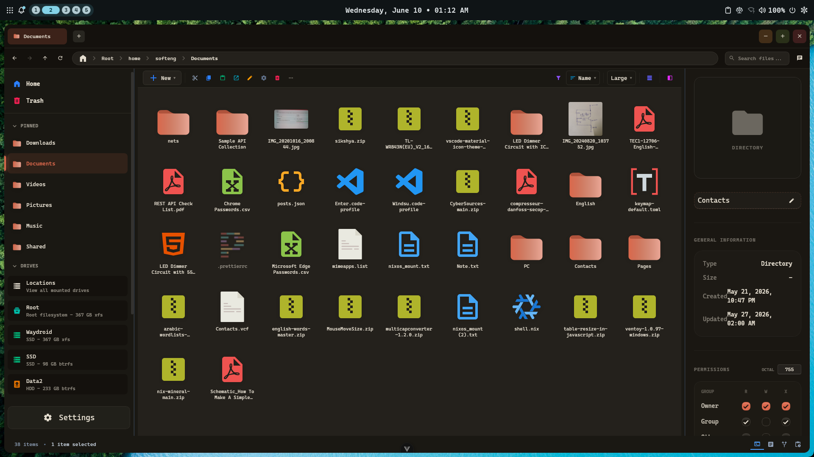
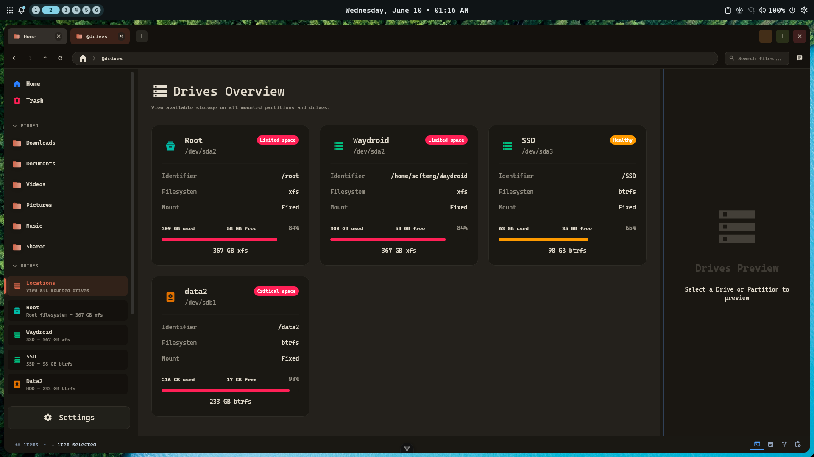
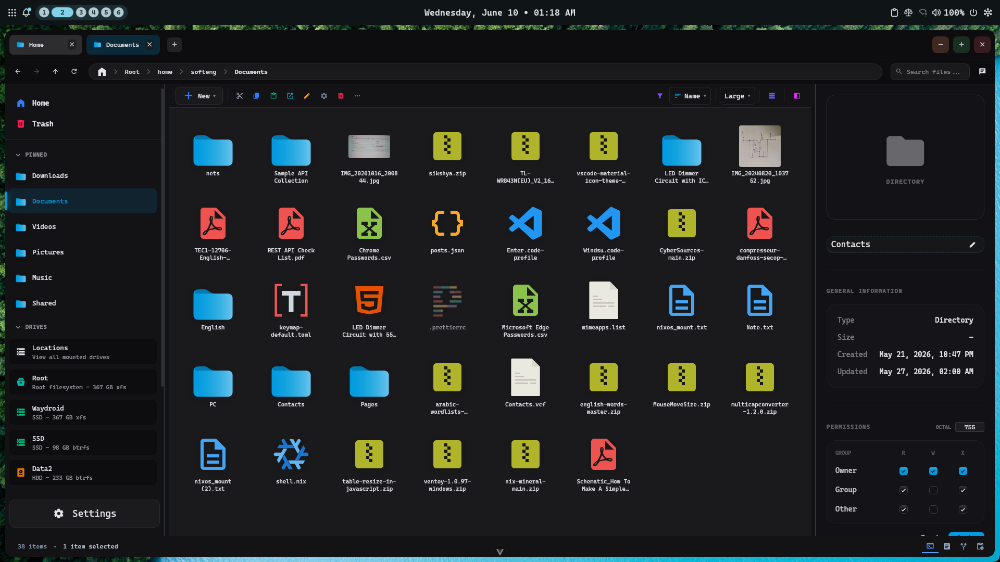
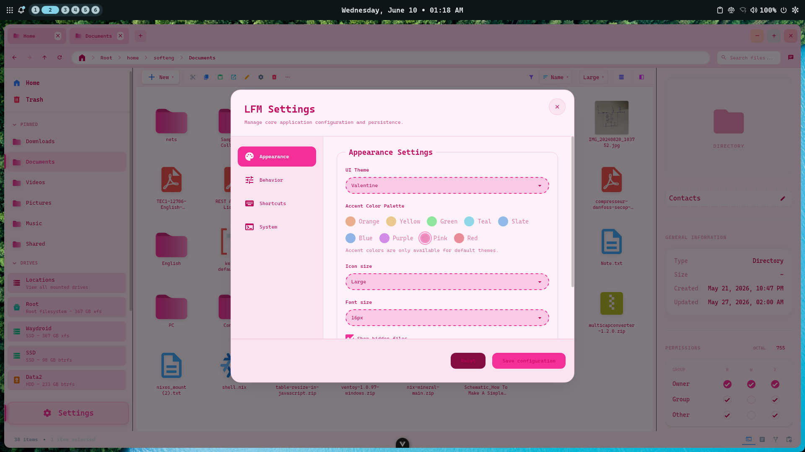
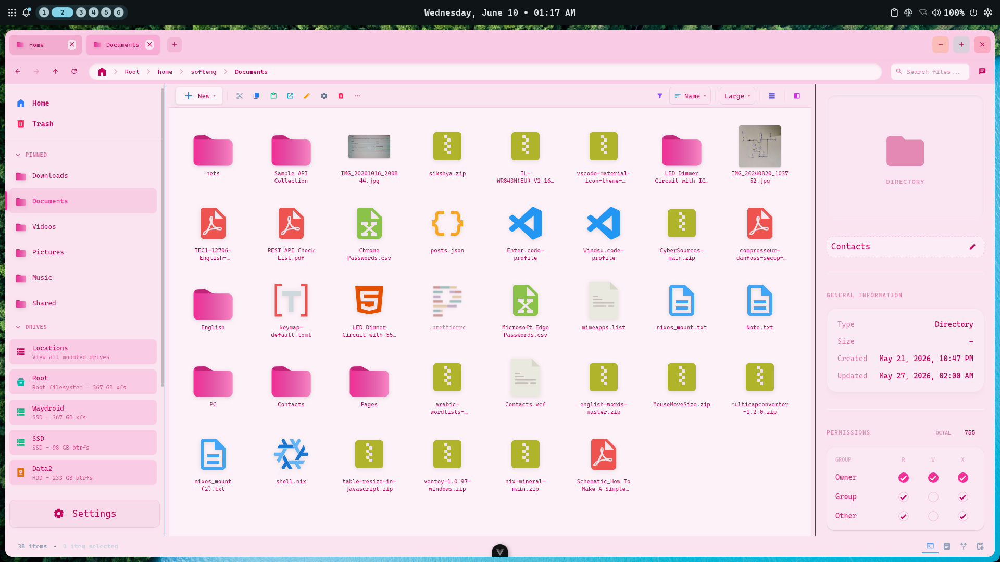

# LFM (Linux File Manager)



**LFM** is a premium, Linux-first desktop file manager designed for users who crave the efficiency of Linux with the modern, refined aesthetics of contemporary desktop environments. Built with **Vue 3**, **Tauri 2**, and **Rust**, LFM provides a native-feeling experience that is fast, modular, and beautiful.

---

## 🎨 Philosophy: "Linux-Native, Windows-Familiar"

LFM bridges the gap between the power of the Linux filesystem and the polished user interface patterns familiar to modern Windows 11 users.

- **Linux-First**: Native integration with Linux workflows, focused on speed and reliability.
- **Modern Aesthetics**: A curated UI using **Tailwind CSS 4** and **DaisyUI 5**, featuring smooth animations and a refined dark mode.
- **Modular Architecture**: Features are organized into clean "feature folders" for high maintainability and easy community extension.

---

## 🛠️ Technical Stack

- **Frontend**: Vue 3 (Composition API), TypeScript, Pinia (State Management)
- **Backend**: Rust, Tauri 2 (Native System Access)
- **Styling**: Tailwind CSS 4, Sass, DaisyUI 5
- **Tooling**: Vite, Vitest, ESLint, Prettier

---

## 🚀 Getting Started

### Prerequisites

- **Node.js**: >= 20.19.0
- **pnpm**: >= 10.14.0
- **Rust Toolchain**: `rustc` and `cargo`
- **System Dependencies**: See [System Requirements](#system-requirements) for Linux.

### Installation

```bash
# Clone the repository
git clone https://github.com/softeng/proj.LFM.git
cd proj.LFM

# Install dependencies
pnpm install

# Run in development mode
pnpm run dev
```

---

## 🛡️ Forking & Contribution Policy

LFM is **Free and Open Source** under the **GPL-v3 License**.

### Centralized Development

To maintain a high-quality, unified experience for all users, we strongly encourage all developers to contribute directly to this repository rather than creating independent versions.

- **Contribute**: Please submit Pull Requests for features and bug fixes.
- **Branding**: The name **LFM**, its logo, and its specific design tokens are part of the official project identity. If you fork this project, you **must** rename it and use distinct branding to avoid user confusion.
- **Upstream First**: We aim to be the best file manager for Linux. Let's build it together here!

---

## 📜 License

Distributed under the **GNU GPL v3**. See [LICENSE](LICENSE) for more information.

---

## 🤝 Community & Support

- **Code of Conduct**: See [CODE_OF_CONDUCT.md](CODE_OF_CONDUCT.md)
- **Guidelines**: See [CONTRIBUTING_GUIDELINE.md](CONTRIBUTING_GUIDELINE.md)
- **Author**: Islam Ahmed <softeng.islam@gmail.com>

---

## 📸 Screenshot





